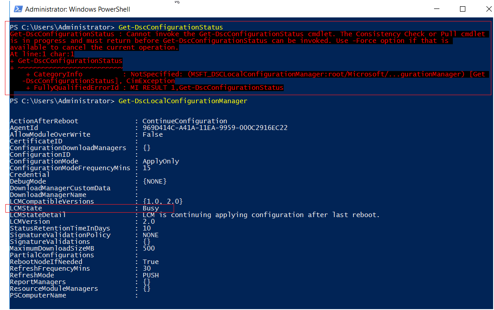
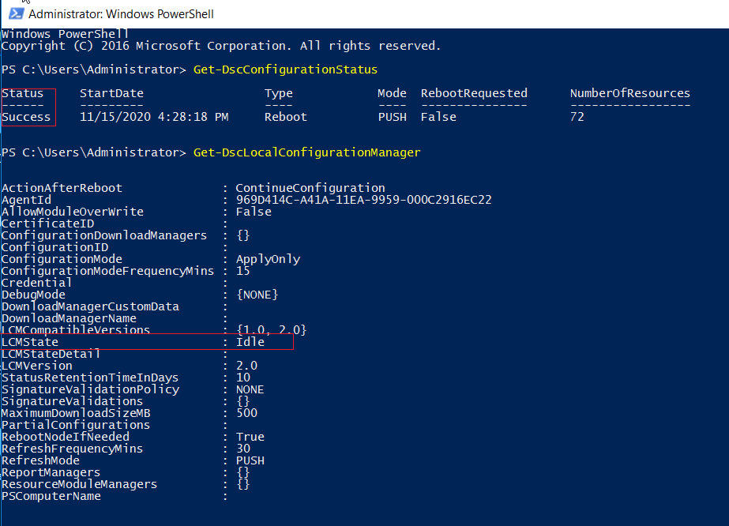
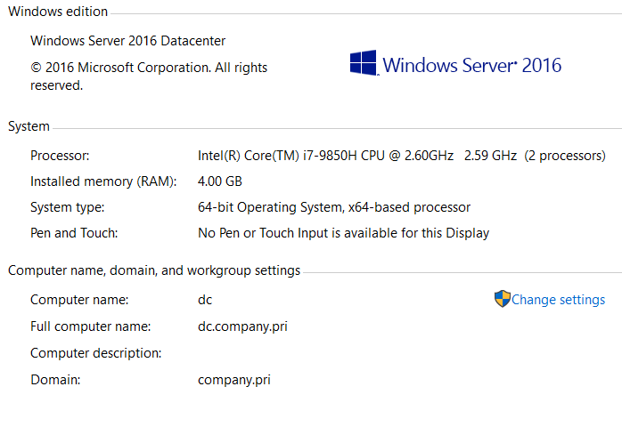

# Introduction

This PowerShell DSC script will automatically build a LDAP server using Microsoft Active Directory on Windows Server 2016.

NOTE: My Colleague also tested the script on Windows Server 2012 and it is working fine. 😀

The LDAP server supports the following functionalities for testing:

- Simple
- Digest-MD5
- Kerberos
- LDAPS(LDAP over SSL)
- Active Directory Certificate Services(ADCS)

# How to use

Change you own domain config at `AD-Configs\AD-DomainConfig.json`. E.g. `IPAddressCIDR`, `DNSAddress`, `GatewayAddress`, `InterfaceAlias`.

Open Windows PowerShell as Administrator, run: `prepDomainController.ps1` and then `buildDomainController.ps1`. You computer will be automatically restarted serveral times. All you have to do is just wait(about 15 minutes in my VMware VM).

## How to check LDAP is finished

You can use `Get-DscConfigurationStatus` and `Get-DscLocalConfigurationManager` to check whether LDAP server is setup.

Ongoing output: LCMState is Busy

Successful output: 

Some other AD commands: `Get-ADUser -Filter *`, `Get-ADComputer -Filter *`, `ldp.exe` to debug LDAP settings.

# LDAP Test Information Details

- Domain Name: `company.pri`
- Domain Controller Name: `dc.company.pri`
- Certificate Root CA name: `dc.company.pri`
- User Login Format: `cn`
- Server Name: `ldap://dc.company.pri` or `ldaps://dc.company.pri`
- Server Port Number: `389` for ldap://, `636` for ldaps://
- Name Path to Groups: `OU=LDAPGroups,DC=company,DC=pri`
- Name Path to Users:  `OU=LDAPUsers,DC=company,DC=pri`

- Kerberos
  - Kerberos Realm: `COMPANY.PRI`
  - DC Host: `dc.company.pri`
  - DC Port: `88`

# Certificate

You can export the `Root CA` from Server Manager -> Tools -> Certification Authority -> root CA name -> Right click -> Properties -> General -> View Certificate -> Details -> Copy to File.

# Users and Groups

## Groups

- LDAP Administrators
- LDAP Test1
- LDAP Test2
- LDAP Test3

## Users
| Users | Display Name | Groups |
| ---- | ---- | ---- |
| ldapadmin | LDAP Admin | LDAP Administrators |
| ldaptest1 | LDAP Test User1 | LDAP Test1 |
| ldaptest2 | LDAP Test User2 | LDAP Test2 |
| ldaptest3 | LDAP Test User3 | LDAP Test3 |

# Reference

This PowerShell script is inspired by following  Pluralsight courses:

- [Install and Configure Active Directory Domain Servies in Windows Server 2016 by Greg Shield](https://app.pluralsight.com/library/courses/install-configure-adds-windows-server-2016)
- [Implementing Active Directory Certificate Services in Windows Server 2016 by Gary Grudzinskas](https://app.pluralsight.com/library/courses/windows-server-2016-active-directory-certificate-services/table-of-contents)

# Author & Contact

Please contact `jackyim1123@gmail.com` if you have any issues.
